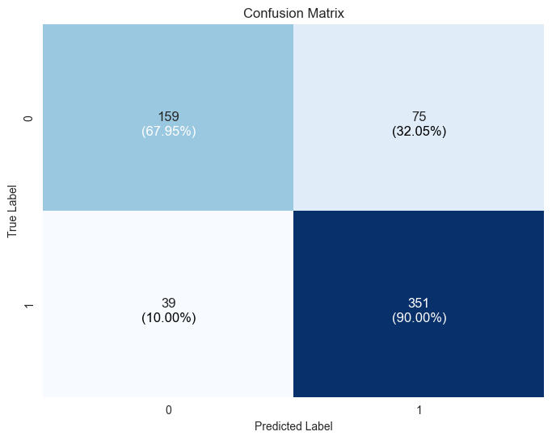
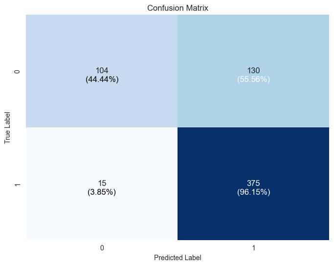
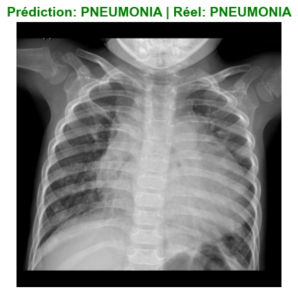

# PneumonialDetection – Computer Aided Diagnosis de la Pneumonie


<details>
  <summary>Definition Computer Aided Diagnosis</summary>
  CAD is an interdisciplinary technology combining elements of artificial intelligence and computer vision with radiological and pathology image processing. source(https://en.wikipedia.org/wiki/Computer-aided_diagnosis)
</details>

PneumonialDetection est un projet de **diagnostic assisté par ordinateur** visant à aider les médecins à détecter la pneumonie à partir de radiographies thoraciques (chest X-ray).  
L’objectif est de comparer plusieurs modèles de deep learning pour classifier automatiquement une radio en deux catégories :

- **NORMAL** : pas de pneumonie  
- **PNEUMONIA** : pneumonie bactérienne ou virale  

Les modèles étudiés dans ce projet sont :

- Un **MLP (Multilayer Perceptron)**  
- Un **CNN (Convolutional Neural Network)**  
- Un modèle **VGG19** pré-entraîné, adapté à la tâche de classification d’images.

---

## 1. Données

Le projet utilise le dataset Kaggle :

> **Chest X-Ray Images (Pneumonia)**  
> https://www.kaggle.com/datasets/paultimothymooney/chest-xray-pneumonia

Ce dataset contient trois dossiers principaux :

- `train/`
- `test/`
- `val/`

Dans chaque dossier, on retrouve :

- `NORMAL/` – radiographies de poumons sains  
- `PNEUMONIA/` – radiographies de poumons atteints de pneumonie  

---

## 2. Structure du projet

Structure de répertoire :

```bash
.
├── PneumonialDetection.ipynb        # Notebook principal (expérimentations & résultats)
├── dataset.py            # Utilitaires pour charger/prétraiter les images
├── requirements.txt      # Dépendances Python
├── dataset/           # Dossier du dataset Kaggle (train/test/val)
└── README.md             # Ce fichier
```

> ⚠️ **Important :** Le dossier `dataset` (extrait du zip Kaggle) doit se trouver **au même niveau** que le fichier `ZOIDBERG.ipynb` et `dataset.py`.

---

## 3. Installation

### 3.1. Prérequis

- Python 3.8+  
- `pip`  
- `virtualenv` (optionnel mais recommandé)  
- Jupyter Notebook ou JupyterLab

### 3.2. Cloner le projet

```bash
git clone https://github.com/shanein/PneumoniaDetection.git
cd PneumoniaDetection/
```

### 3.3. Créer et activer un environnement virtuel

```bash
# Création de l'environnement virtuel
python -m venv .venv

# Activation (Linux / macOS)
source .venv/bin/activate
```

### 3.4. Installer les dépendances

```bash
pip install -r requirements.txt
```

---

## 4. Télécharger et préparer le dataset

1. Aller sur Kaggle :  
   https://www.kaggle.com/datasets/paultimothymooney/chest-xray-pneumonia

2. Télécharger l’archive.

3. Extraire le contenu, ce qui doit créer un dossier `datasets/` contenant :

```bash
chest_xray/
  dataset/
   ├── test/
   │   ├── NORMAL/
   │   └── PNEUMONIA/
   ├── train/
   │   ├── NORMAL/
   │   └── PNEUMONIA/
   └── val/
       ├── NORMAL/
       └── PNEUMONIA/
```

4. Déplacer ce dossier `dataset/` à la **racine du projet**, au même niveau que `ZOIDBERG.ipynb`.

---

## 5. Lancer le notebook

Depuis la racine du projet (avec l’environnement virtuel activé) :

```bash
jupyter notebook
```

Ou :

```bash
jupyter lab
```

Puis ouvrir le fichier :

```text
PneumonialDetection.ipynb
```

Le notebook :

- Charge les images via `dataset.py`
- Applique les prétraitements (redimensionnement, normalisation, etc.)
- Entraîne successivement :
  - un MLP
  - un CNN
  - un modèle VGG19
- Affiche les métriques de performance et différentes visualisations (courbes d’apprentissage, matrices de confusion, etc.)
---

## 6. Modèles et performances (résumé)

Les trois modèles sont entraînés et évalués sur le même ensemble de test, ce qui permet de comparer leurs performances globales.

Exemple de synthèse (test set) :

| Modèle | Type                      | Précision (accuracy) | Observations principales                                                | Matrice de confusion (exemple sur test set)|
|--------|---------------------------|----------------------|-------------------------------------------------------------------------|----------------------------------------------------------------|
| MLP    | Réseau fully-connected    | ~0.82                | Bonnes performances, mais tendance à sur-ajuster.                       |     |
| CNN    | Réseau convolutionnel     | ~0.83                | Meilleure performance globale, bon compromis entre précision et recall. | |
| VGG19  | CNN profond pré-entraîné  | ~0.75                | Très bon recall sur les pneumonies, mais moins bon sur les cas normaux. |  |

---

## 7. Visualisations et rendus (à compléter avec vos captures)

Les cellules du notebook génèrent plusieurs visualisations que vous pouvez intégrer dans ce README via des captures d’écran :

**Exemple d'une pneumonie détectée par le modèle CNN :** (image d’entrée + label réel + prédiction)



---

## 9. Avertissement

Ce projet a pour objectif pédagogique de montrer comment appliquer le deep learning à un cas de **détection de pneumonie sur radiographies thoraciques**.  
Il ne constitue **pas** un dispositif médical validé et ne doit pas être utilisé en tant qu’outil de diagnostic en situation réelle.
